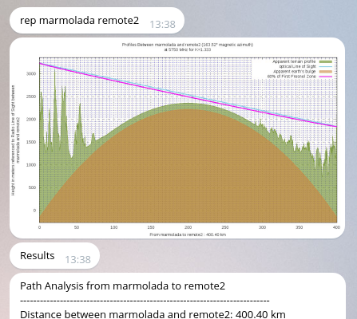
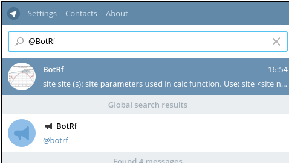

BotRf: telegram bot 
===========================

BotRf is a tool for the electromagnetic spectrum analysis 
of Terrain, loss, and RF Signal Propagation that run on [Telegram Messenger](https://telegram.org/) 

BotRf is a multi-platform tool: 
it run on PC or smartphone where can be installed a [*"Telegram Client"* (Windows, Linux, Mac, Android ...)](https://telegram.org/apps) , or in general by connecting to Telegram via web.

The tool is composed of two parts:

- **splatbot.py**: 
	- python program, is the telegram bot interface manager. It uses the ["nickoala telepot"](https://github.com/nickoala/telepot), a Python framework for Telegram.
- **rfprobe:** a fork of [Splat! Tool](http://www.qsl.net/kd2bd/splat.html), on which are drawn several changes.

The splatbot.py program analyzes the data and commands that the user sets in Telegram and passes them to a remote server, where rfprobe is executed. It analyzes them and generate graphics and reports. 
The analysis results are returned to the user through the Telegram interface.
 
## How to add BotRf to a Telegram Client

In general, bots are simply Telegram accounts operated by software.
To add BotRf on your Telegram Client, simply write ***@BotRf*** on the search bar.

 

## People who have contributed to the project: 

* Marco Zennaro - ICTP, Guglielmo Marconi Wireless Laboratory (http://wireless.ictp.it/)
* Ermanno Pietrosemoli - ICTP, Guglielmo Marconi Wireless Laboratory (http://wireless.ictp.it/)
* Marco Rainone - SolviTech (https://www.linkedin.com/in/marcorainone) (marcorainone@gmail.com)

